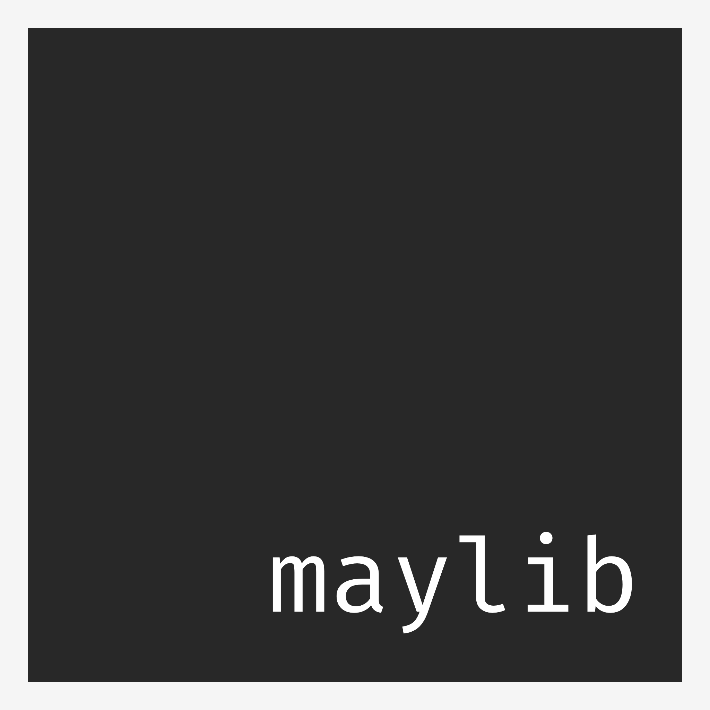

# MayLib

## Multi-Window Raylib

I made multi-window raylib because I needed multiple windows in raylib.

While Maylib is based on raylib, it is not a fork. I just used raylib as a reference

## TODOS
- Switch font rendering to [fontdue](https://docs.rs/fontdue-sdl2/0.3.2/fontdue_sdl2/)
- Possibly Migrate to [gfx](https://github.com/gfx-rs/gfx) rendering
- add more image utilities

### Features
- Supports mp3, wav, vorbis, flac, and aac audio.
- Supports .png, .jpg, .tiff, and .webp images
- Supports .ttf fonts

### Build
**Requirements**
- Cargo
- Vcpkg
- pkg-config
- sdl2
- sdl2-ttf
- sdl2-gfx
- sdl2-image

note that libraries like sdl2, sdl2-ttf, etc. *need* to be installed for the triplet you are building for